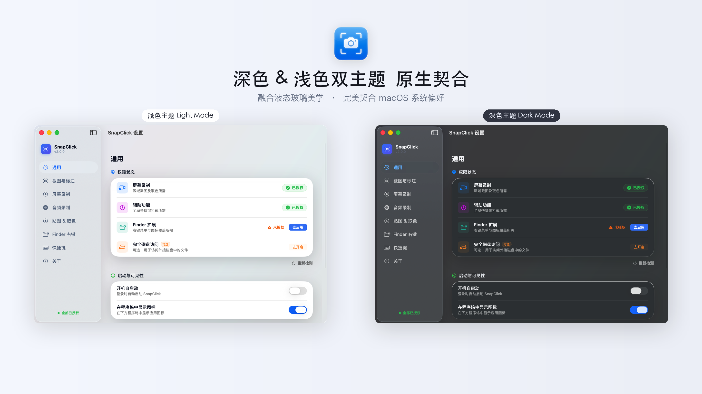
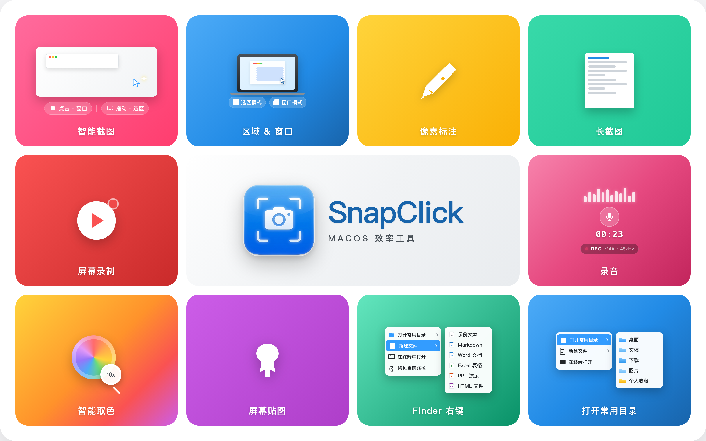
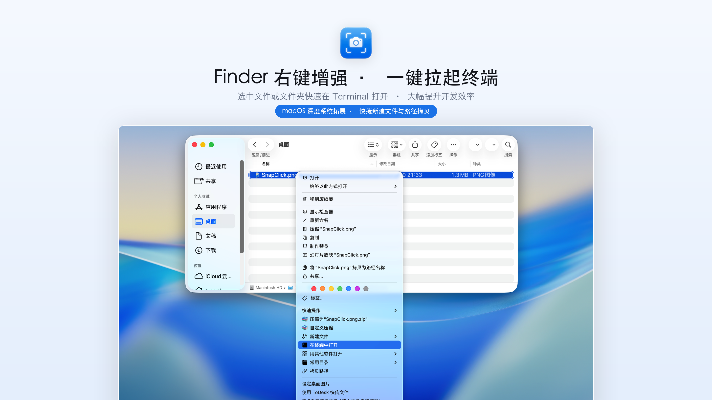
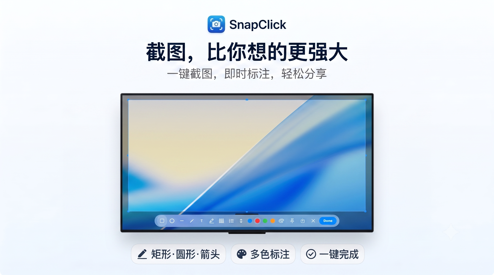
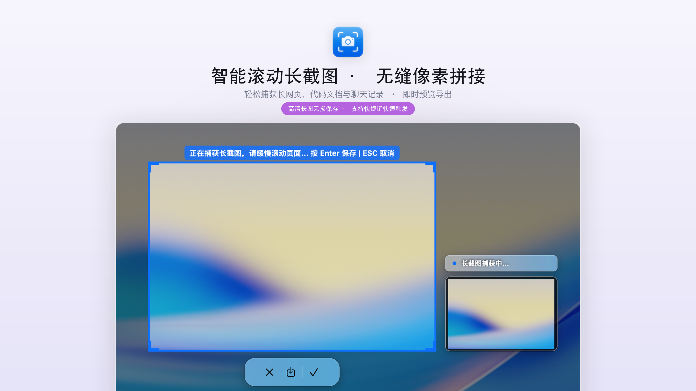
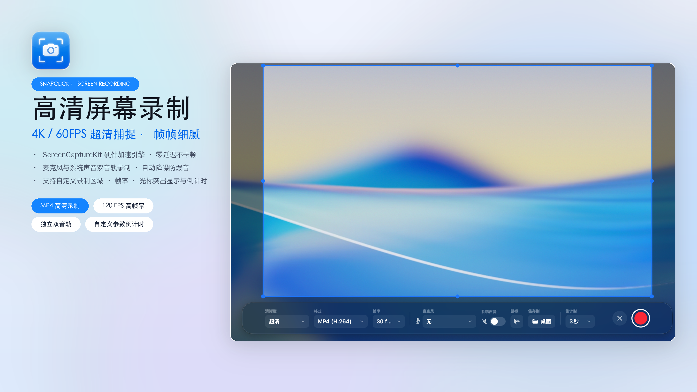
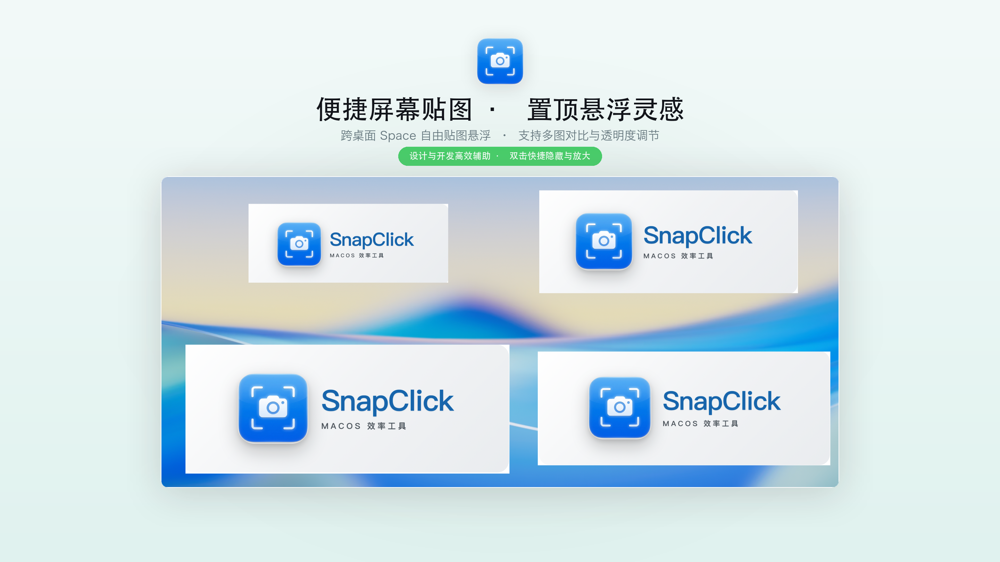
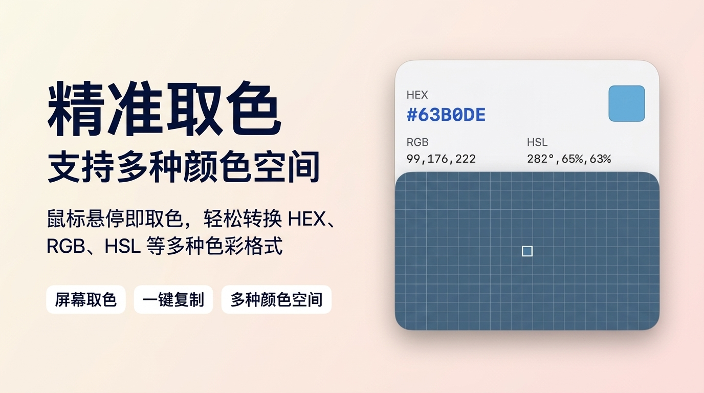

<div align="center">



### macOS Productivity Enhancer — Right-Click · Screenshot Annotation · Screen Recording · Screen Pinning · Smart Color Picker

[](https://github.com/Tyeerth/SnapClick/releases)
[](https://github.com/Tyeerth/SnapClick/releases)
[](https://swift.org)
[](LICENSE)
[](https://github.com/Tyeerth/SnapClick/releases/latest)

A premium productivity tool built exclusively for macOS, integrating Finder menu enhancement, advanced screenshot annotation, high-performance screen recording, screen pinning, and smart color picking — all delivered in a pure native Swift architecture for a silky-smooth, refined experience.

[Features](#-features) · [Installation](#-installation) · [Build from Source](#-build-from-source) · [Contact Author](#-contact-author) · [Official Website](http://snapclick.cn/)

[中文文档](README.md)

<br />


<br />


</div>

---

## ✨ Features

### 🔧 Finder Right-Click Menu Enhancement

- **Create Common Files** — Right-click to create `.txt`, `.md`, `.docx`, `.xlsx`, `.pptx`, `.html`, `.css`, `.js`, `.py`, `.sh` and more. Supports custom templates with auto-rename on creation.
- **Cut & Paste Files** — A simpler cut-paste workflow than native macOS, supporting cross-directory moves.
- **Quick Move/Copy To** — Add favorite directories for one-click file archiving.
- **Advanced Path Copy** — Copy full path, filename only, or POSIX-compliant path.
- **Quick Open in Terminal/Editor** — Right-click to launch Terminal, iTerm2, VS Code, Warp, or Xcode in the current directory.

<br>

<br>

---

### 📸 Advanced Screenshot & Annotation

- **Area Screenshot & Smart Window Detection** — Drag to select freely or auto-snap to hovered windows. Supports hotkey ⌥⇧A.
- **Smart Scrolling Screenshot (Long Screenshot)** — Capture long webpages or documents seamlessly through intelligent continuous capture.
- **Advanced Annotation Editor** — A rich toolbar with rectangles, ellipses, lines, arrows, text, freehand brush, highlight overlays, step numbers, and pixel-level mosaic.
- **Beautification & Framing** — Elegant frosted glass shadows, custom 0-32px rounded window borders.

<br>
<div align="center">
  
  
</div>
<br>

---

### 🎥 High-Performance Screen Recording

- **Native SCK Architecture** — Powered by Apple's official ScreenCaptureKit framework, hardware-accelerated with extremely low system overhead.
- **Multi-Dimension Capture Area** — Supports custom region, full-screen, and per-application window recording modes.
- **Ultra High Frame Rate** — Supports 30/60/120 FPS recording with H.264 / HEVC codecs, plus a "Source Quality" lossless resolution option.
- **Dual Independent Audio Tracks** — Capture internal system audio (macOS 13+) and external/built-in microphone simultaneously on two separate tracks for easy post-production mixing.
- **HUD Floating Controller** — An independent floating control panel with elapsed time display, pause / resume / stop actions.

<br>

<br>

---

### 📌 Convenient Screen Pinning (Pin Window)

- **Multi-Window Screen Pinning** — Pin screenshots or any image to the top of your screen with one click. Hotkey: ⌥⇧P.
- **Floating Multi-Window Management** — Pins follow across macOS Spaces, supporting multiple pins at once.
- **Free Interactive Adjustment** — Smooth scroll-wheel opacity adjustment, double-click to zoom, and quick pin management bar.

<br>

<br>

---

### 🔍 Precision Magnifier Color Picker

- **16x Precision Magnifier** — A visual 16× pixel-level magnifier with hotkey ⌥⇧C.
- **Multi-Format One-Click Conversion** — Perfectly supports one-click copy of HEX, RGB, HSL, Swift (NSColor), and CSS color codes.
- **Color History** — Intelligently records and displays your 20 most recent color picks.

<br>

<br>

---

## 📥 Installation

### Option 1: Direct Download (Recommended)

Go to the [Releases page](https://github.com/Tyeerth/SnapClick/releases/latest) and download the latest `.dmg` or `.zip` archive. Extract the file and drag the app into your `Applications` directory.

<a href="https://github.com/Tyeerth/SnapClick/releases/latest">
  
</a>

### Option 2: Build from Source

See the [Build from Source](#-build-from-source) section below.

### ⚠️ First-Run Permissions

On first launch, you will be guided to grant the following system permissions so that all features work correctly:

1. **Screen Recording Permission** — Required for high-performance screenshot, scrolling capture, screen recording, and magnifier color picking.
2. **Accessibility Permission** — Required to capture and intercept global hotkeys.
3. **Finder Extension** — Please go to "System Settings → General → Login Items & Extensions → Finder Extensions" and enable `FinderExtension`.

---

## 🏗️ Build from Source

### Prerequisites

- macOS 13.0 (Ventura) or later
- Xcode 15.0 or later
- Apple Developer Account (for code signing)

### Build Steps

1. **Clone the repository**
   ```bash
   git clone https://github.com/Tyeerth/SnapClick.git
   cd SnapClick
   ```

2. **Open the project**
   ```bash
   open SnapClick.xcodeproj
   ```

3. **Configure code signing** — Under Xcode's `Signing & Capabilities`, configure your Development Team for both targets:
   - `SnapClick` (Main App, Bundle ID: `com.snapclick.app`, non-sandboxed privileged mode)
   - `FinderExtension` (Right-click plugin, Bundle ID: `com.snapclick.app.FinderExtension`, sandboxed, bound to App Group `group.4DAY66XCT4.com.snapclick.shared`)

4. **Build and Run** — Select Scheme `SnapClick` → Destination `My Mac` → Run (⌘R)

---

## 📮 Contact Author

If you have questions or feature suggestions, feel free to reach out through the following channels:

- **Official Website**: <http://snapclick.cn/>
- **Email**: [tyeerth@163.com](mailto:tyeerth@163.com)

---

## 📄 License

This project is licensed under the [Apache License 2.0](LICENSE).
